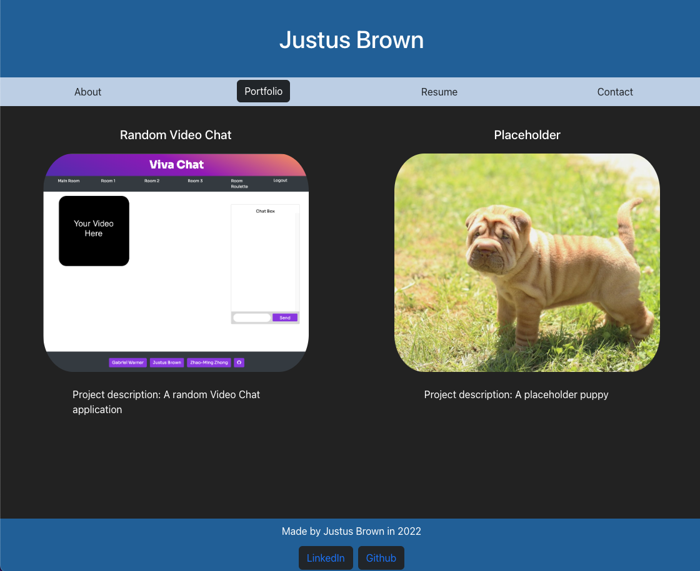
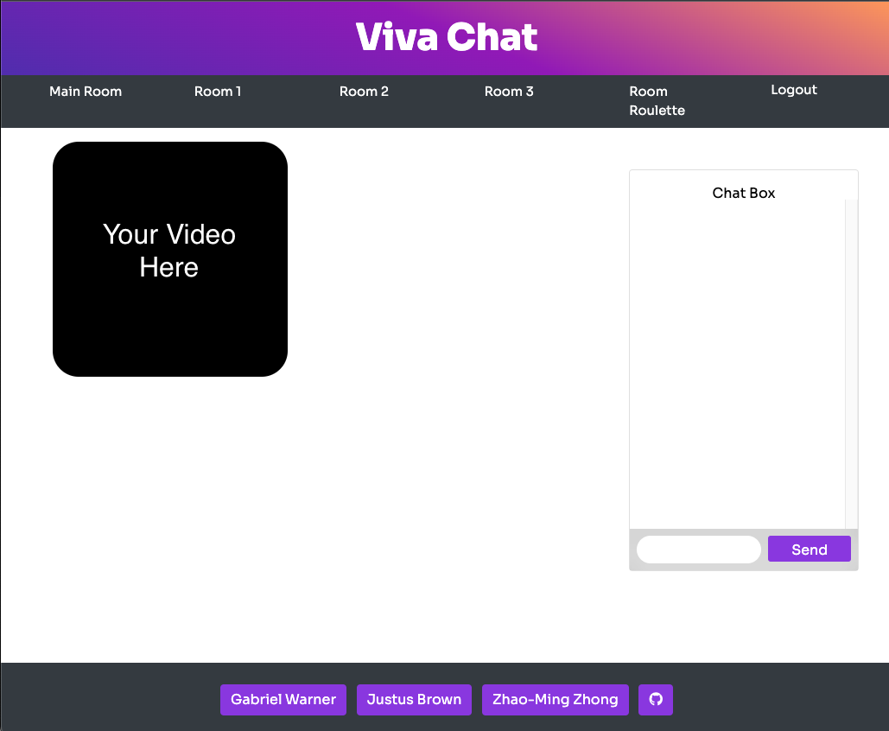
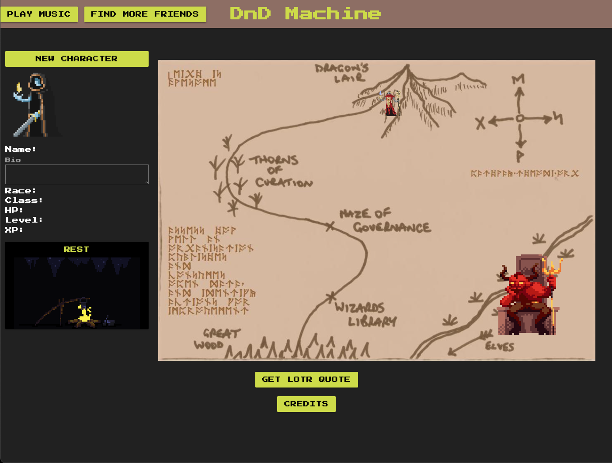

### Hi there 👋

## Full Stack Developer
Full Stack Web Developer with a background in Biology/Healthcare. Skills include JavaScript (Node.js, React.js), HTML, CSS, and SQL/NoSQL/MongoDB. Graduate from the University of Washington’s Full Stack Web Development Certificate. Interested in the intersection of technology and biology. A creative and thorough problem-solver with a ready-to-learn attitude. Managed a project with two other members that was voted best UI/UX and People’s Choice for Best Application. Passionate about utility, beauty, and a positive user experience.

📫 You can reach me directly at justus.c.brown@gmail.com

## Highlights
|[Portfolio](https://brownj47.github.io/portfolio/)|[VivaChat](https://vivachat.herokuapp.com/)|[DnD Machine](https://knight19jonathan.github.io/Adventure-Game-Project-/)|
|---|---|---|
||||
|My portfolio page showcasing past projects. Built with React. |A video and group chat application for the browser. Features a randomized chatroom button. |A simple turn-based game for the browser. Based on DnD.|

## Skills & Stats

 

## Contact
 

<!--
**brownj47/brownj47** is a ✨ _special_ ✨ repository because its `README.md` (this file) appears on your GitHub profile.

Here are some ideas to get you started:

- 🔭 I’m currently working on ...
- 🌱 I’m currently learning ...
- 👯 I’m looking to collaborate on ...
- 🤔 I’m looking for help with ...
- 💬 Ask me about ...
- 📫 How to reach me: ...
- 😄 Pronouns: ...
- ⚡ Fun fact: ...
-->
